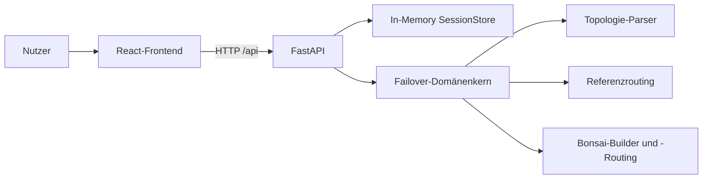
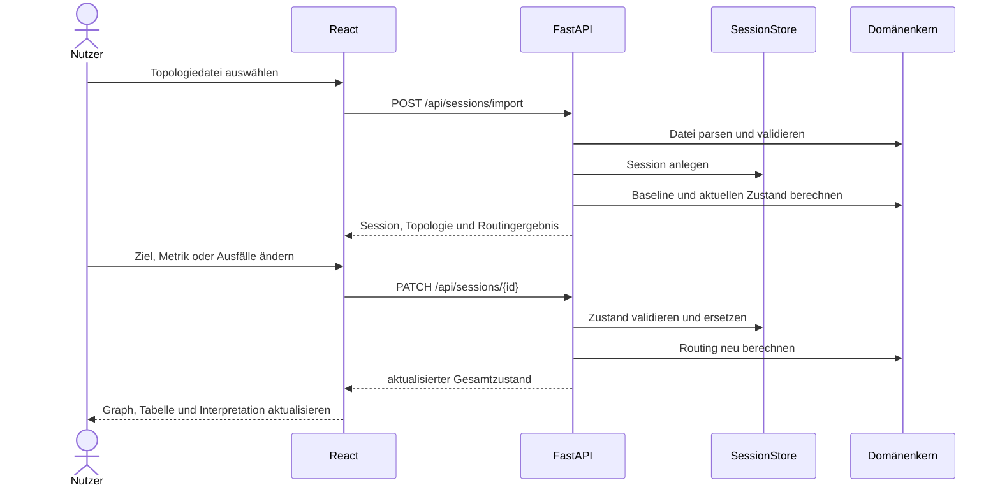

# Architekturübersicht

## Ziel und Abgrenzung

Das System ist ein HCI-orientierter Prototyp zur interaktiven Visualisierung von
Failover-Routingzuständen. Der fachliche Schwerpunkt liegt auf der verständlichen
Darstellung von Normalbetrieb, Umleitung und Unerreichbarkeit. Es wird keine neue
Routingheuristik entwickelt.

Als Referenzstrategien dienen eine deterministische Kürzeste-Pfad-Berechnung und
eine deterministische Greedy-Dekomposition nach dem Bonsai-Prinzip. SQLite,
Round-Robin-Vergleiche und simulierte Konvergenzzeiten sind nicht Bestandteil
der implementierten Kernarchitektur.

## Systemkontext

Das Frontend wird während der Entwicklung durch Vite bereitgestellt. Requests an
`/api` werden an die FastAPI-Anwendung auf `127.0.0.1:8000` weitergeleitet.
Frontend und Backend kommunizieren ausschließlich über JSON-basierte
HTTP-Schnittstellen.

## Schichten und Verantwortlichkeiten

### 1. Präsentationsschicht: React und Vite

Die Präsentationsschicht befindet sich unter `src/`. Sie übernimmt:

- Importauswahl für TopoHub-JSON und SNDlib-XML,
- Auswahl von Zielknoten und Routingmetrik,
- Ausfall und Wiederherstellung von Kanten,
- Darstellung von Topologie, Baseline und aktuellem Routingzustand,
- Kennzeichnung umgeleiteter und unerreichbarer Knoten,
- Anzeige von Systemzustand, Erreichbarkeit und Ereignisprotokoll,
- verständliche Interpretation der Auswirkungen eines Fehlers.

Der Browser hält die für die Interaktion benötigte Session-ID sowie die jeweils
aktuelle API-Antwort. Die fachliche Routingberechnung findet nicht im Frontend
statt.

### 2. Anwendungsschicht: FastAPI

Die API wird in `backend/api.py` definiert und stellt derzeit folgende Endpunkte
bereit:

| Methode | Endpunkt | Aufgabe |
| --- | --- | --- |
| `GET` | `/api/health` | Verfügbarkeitsprüfung |
| `POST` | `/api/sessions/import` | Topologie importieren, Session anlegen und Ausgangszustand berechnen |
| `PATCH` | `/api/sessions/{session_id}` | Ziel, Metrik oder ausgefallene Kanten ändern und Routing neu berechnen |
| `POST` | `/api/sessions/{session_id}/critical-failure-search` | Kleinste kritische Ausfallkombination für die aktive Strategie suchen |

Die API validiert Eingaben, koordiniert Sessionzustand und Domänenkern und
liefert eine für das Frontend normalisierte Antwort.

### 3. Sessionzustand: In-Memory `SessionStore`

Jeder Topologieimport erzeugt eine `SimulationSession` mit:

- UUID als Session-ID,
- normalisierter Topologie,
- Routingkonfiguration,
- Menge ausgefallener Kanten.

Der `SessionStore` speichert Sessions in einem prozesslokalen Dictionary. Ein
`RLock` synchronisiert Zugriffe; unveränderliche Dataclasses und
`dataclasses.replace` unterstützen atomare Zustandswechsel.

Diese Entscheidung passt zum interaktiven Prototyp: Zustandsänderungen benötigen
keine Datenbankzugriffe und können unmittelbar neu ausgewertet werden. Daraus
folgen bewusst akzeptierte Grenzen:

- Sessions gehen bei einem Backend-Neustart verloren,
- Sessions werden nicht zwischen mehreren Backend-Prozessen geteilt,
- es gibt derzeit keine Ablauf- oder Löschstrategie,
- die Session-ID muss im Browser verfügbar bleiben.

### 4. Domänenschicht: `backend/failover_core`

Der UI-unabhängige Domänenkern enthält:

- unveränderliche Modelle für Topologie, Routing, Fehler und Ergebnisse,
- Parser und Validierung für TopoHub-JSON und SNDlib-XML,
- deterministische Routingberechnung,
- Szenarioimport und -export,
- minimale Ausfallsuche als vom UI unabhängige Kernfunktion.
- Kantenkonnektivität, Greedy-Aboreszenzen und zirkuläre Bonsai-Simulation.

Die Trennung ermöglicht automatisierte Tests ohne Browser und verhindert, dass
Darstellungslogik in die Routingberechnung einfließt.

## Referenzstrategie

Die implementierte Strategie heißt `deterministic_shortest_path`. Für jeden
Knoten wird ein Pfad zum gewählten Ziel berechnet.

Unterstützte Metriken:

- `hop_count`: jede Kante besitzt Kosten von 1,
- `edge_weight`: das importierte Kantengewicht wird verwendet.

Bei gleichwertigen Pfaden erfolgt ein lexikografisches Tie-Breaking anhand von
Knoten- und Kanten-IDs. Dadurch liefert derselbe Eingabezustand reproduzierbare
Ergebnisse. Die Strategie dient als verständliche Grundlage zur Untersuchung der
Visualisierung und ist kein Forschungsbeitrag zu Routingalgorithmen.

## Bonsai-Strategie

Die Strategie `bonsai_greedy` arbeitet ausschließlich auf ungerichteten
physischen Topologien. Jede physische Kante wird intern als zwei gerichtete
Bögen behandelt. Die globale Kantenkonnektivität `k` bestimmt die Zahl der
vollständigen, paarweise arc-disjunkten Aboreszenzen.

Die Bäume werden nacheinander vom Ziel aus aufgebaut. Kandidaten werden nach
der resultierenden Tiefe und danach lexikografisch sortiert. Beim Bau von `Ti`
wird ein Bogen `(u, v)` nur übernommen, wenn im unbenutzten Arc-Graphen ohne
diesen Bogen noch mindestens `k-i` bogendisjunkte Wege von `u` zum Ziel
existieren.

Pakete starten auf `T1`. Ist der benötigte physische Link ausgefallen, wird am
aktuellen Knoten zirkulär zum nächsten Baum gewechselt. Der Trace enthält jeden
Weiterleitungsschritt und jeden Baumwechsel. Ein wiederholter Zustand aus
Knoten, Baum und Eingangsrichtung wird als Schleife erkannt.

Die physische Erreichbarkeit wird unabhängig geprüft. Dadurch unterscheidet die
API `delivered`, `physically_unreachable`, `dead_end` und `loop`. Die
automatische Suche bewertet im Bonsai-Modus nur `dead_end` und `loop` bei
weiterhin bestehender physischer Verbindung als routingkritisch. Weitere
Details stehen in [docs/BONSAI.md](docs/BONSAI.md).

## Baseline, Fehlerzustand und Ergebnissemantik

Für jede Auswertung berechnet der Domänenkern:

- `baseline_paths`: Pfade ohne Kantenausfälle,
- `current_paths`: Pfade unter den aktuell ausgewählten Ausfällen,
- `changed_node_ids`: Knoten, deren aktueller Pfad von der Baseline abweicht,
- `affected_node_ids`: zuvor erreichbare Knoten, die das Ziel nicht mehr erreichen.

In der Oberfläche werden unerreichbare Knoten aus
`affected_node_ids` getrennt von den verbleibenden umgeleiteten Knoten
dargestellt. Dadurch entstehen drei fachliche UI-Zustände:

| Zustand | Bedingung |
| --- | --- |
| Normalbetrieb | keine Kante ausgefallen |
| Failover aktiv | mindestens eine Kante ausgefallen, aber kein Knoten unerreichbar |
| Teilnetz unerreichbar | mindestens ein zuvor erreichbarer Knoten ohne aktuellen Pfad |

## Datenfluss

Die API liefert nach jeder Änderung einen vollständigen konsistenten Zustand.
Damit benötigt das Frontend keine eigene Rekonstruktion fachlicher
Zwischenergebnisse.

## Import und Validierung

Unterstützte Eingabeformate:

- TopoHub Node-Link JSON (`.json`),
- SNDlib XML (`.xml`).

Der Import normalisiert Knoten, Kanten, Positionen und Gewichte in das gemeinsame
Domänenmodell. Validiert werden unter anderem eindeutige IDs, gültige
Kantenendpunkte, endliche nichtnegative Gewichte und ein Dateigrößenlimit von
10 MiB. DTD- und Entity-Deklarationen in XML werden abgewiesen.

## Qualitätsabsicherung

Die Backendtests decken unter anderem Import, Validierung, Sessionupdates,
direktes Routing, Failover, Unerreichbarkeit, gerichtete und parallele Kanten,
beide Metriken sowie deterministisches Tie-Breaking ab. Der Frontend-Build
prüft die Produktionskompilierung. Die HCI-Zustände werden zusätzlich anhand
reproduzierbarer Szenarien visuell geprüft.

## Bewusste Architekturentscheidungen

| Entscheidung | Begründung |
| --- | --- |
| React statt Streamlit | gezielte interaktive Visualisierung und klare Kontrolle über UI-Zustände |
| FastAPI als Schnittstelle | Trennung von Darstellung und Python-Domänenlogik |
| In-Memory statt SQLite | kurzlebiger interaktiver Simulationszustand ohne Persistenzanforderung |
| deterministische Referenzstrategie | reproduzierbare Grundlage für Visualisierung und HCI-Evaluation |
| vollständige Antworten nach Updates | konsistente UI ohne verteilte fachliche Zustandsrekonstruktion |

## Aktuelle Grenzen

Nicht Teil des gegenwärtigen Prototyps sind insbesondere dauerhafte Persistenz,
verteilte Sessions, Mehrbenutzerbetrieb, eine neue Routingheuristik und eine
vollständige mobile Optimierung. Diese Punkte sind mögliche Erweiterungen, aber
keine Voraussetzung für die Untersuchung der HCI-orientierten
Failover-Visualisierung.
