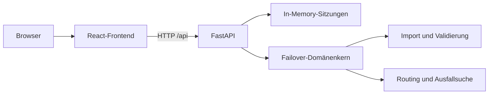

# Failover Routing Visualizer

Browserbasierter Prototyp zur interaktiven Untersuchung von
Failover-Routingzuständen. Die Anwendung entstand im Rahmen einer
Bachelorarbeit an der TU Dortmund und stellt eine deterministische
Kürzeste-Pfad-Strategie einem vorbereiteten lokalen Failover nach dem
Bonsai-Prinzip gegenüber.

**Live-Anwendung:**
[routing-simulator-hci-concept.onrender.com](https://routing-simulator-hci-concept.onrender.com/)


## Funktionsumfang

- Import von TopoHub-Node-Link-JSON, SNDlib-XML und einem begrenzten
  GraphML-Teilformat
- deterministische kürzeste Pfade mit Hop-Anzahl oder Kantengewicht
- Bonsai-Greedy mit vollständigen, bogendisjunkten Aboreszenzen
- manuelle, reversible Kantenausfälle und automatische Suche nach kritischen
  Ausfallkombinationen
- getrennte Erkennung physischer Trennung, Routing-Schleife und Sackgasse
- Vergleich von Ausgangs- und Fehlerzustand mit Pfaden, Statusangaben,
  Routentabelle und Ereignisprotokoll
- Zoom, Verschieben, automatisches Einpassen, Knotenkürzel und Hervorhebung
  einzelner Routen für größere Topologien

Die Anwendung entwickelt keine neue Routingheuristik. Sie verwendet bewusst
deterministische Referenzverfahren, um Zustandsänderungen reproduzierbar
darzustellen. Nicht Bestandteil des Prototyps sind unter anderem dauerhafte
Sitzungen, Mehrbenutzerbetrieb, Round-Robin-Verfahren und garantierte
Konvergenzzeiten.

## Architektur



Das Frontend stellt ausschließlich die vom Backend berechneten Zustände dar.
Parser, Validierung, Routing, Fehlerklassifikation und Szenarioserialisierung
liegen im UI-unabhängigen Python-Domänenkern. Eine ausführliche Beschreibung
steht in [ARCHITECTURE.md](ARCHITECTURE.md).

## Lokal starten

Vorausgesetzt werden Python 3.12 sowie Node.js 22 oder eine kompatible Version.

```bash
python -m venv .venv
source .venv/bin/activate
python -m pip install --require-hashes -r requirements-lock.txt
npm ci
```

Unter Windows wird die virtuelle Umgebung mit
`.venv\Scripts\activate` aktiviert. Anschließend werden API und Frontend in
zwei Terminals gestartet:

```bash
npm run dev:api
```

```bash
npm run dev
```

Das Frontend ist danach unter `http://127.0.0.1:5173` erreichbar. Vite leitet
Anfragen an `/api` an FastAPI auf Port 8000 weiter.

## Container starten

```bash
docker build -t failover-routing-visualizer .
docker run --rm -p 8000:8000 failover-routing-visualizer
```

Oberfläche und Healthcheck liegen anschließend unter
`http://127.0.0.1:8000/` und `http://127.0.0.1:8000/api/health`.

## Qualitätssicherung

```bash
npm run test:backend
npm run test:frontend
npm run lint
npm run build
```

Auf dem festgelegten Studienstand
`ed3b68c36485f9a14062958832bc3fd9693e3975` bestehen 52 Backend-, API- und
Routingtests sowie 15 Frontend-Logiktests. Zusätzlich bestehen das
JavaScript-Linting und der Vite-Produktions-Build. Die Bonsai-Implementierung
wurde für alle verbundenen einfachen Graphen mit bis zu fünf Knoten gegen ein
unabhängiges Kantenschnitt-Orakel geprüft. Details stehen in
[docs/BONSAI_VALIDATION.md](docs/BONSAI_VALIDATION.md).

## Dokumentation

| Dokument | Inhalt |
|---|---|
| [REQUIREMENTS.md](REQUIREMENTS.md) | implementierter und geprüfter Anforderungsumfang |
| [ARCHITECTURE.md](ARCHITECTURE.md) | Systemstruktur, Zustandsmodell und Datenfluss |
| [docs/BONSAI.md](docs/BONSAI.md) | projektspezifische Bonsai-Semantik und Grenzen |
| [docs/BONSAI_VALIDATION.md](docs/BONSAI_VALIDATION.md) | fachliche und automatisierte Validierung |
| [docs/DEPLOYMENT.md](docs/DEPLOYMENT.md) | gemeinsames Docker- und Render-Deployment |
| [docs/hci/HCI_EVALUATION.md](docs/hci/HCI_EVALUATION.md) | formative Entwicklung und Evaluationsdesign |
| [docs/hci/USER_STUDY_PROTOCOL.md](docs/hci/USER_STUDY_PROTOCOL.md) | Aufgaben, SUS und Auswertungsplan der Benutzerstudie |

## Reproduzierbarer Bonsai-Fehlerfall

1. `tests/fixtures/bonsai_routing_failure.json` importieren.
2. Zielknoten `T` und `Bonsai (Greedy)` auswählen.
3. In der automatischen Prüfung nach maximal einem Ausfall suchen.
4. Das Ergebnis in die Simulation übernehmen.

Der Fall zeigt einen weiterhin vorhandenen physischen Pfad von `A` nach `T`,
während die vorberechnete Bonsai-Strategie in eine Schleife gerät.
