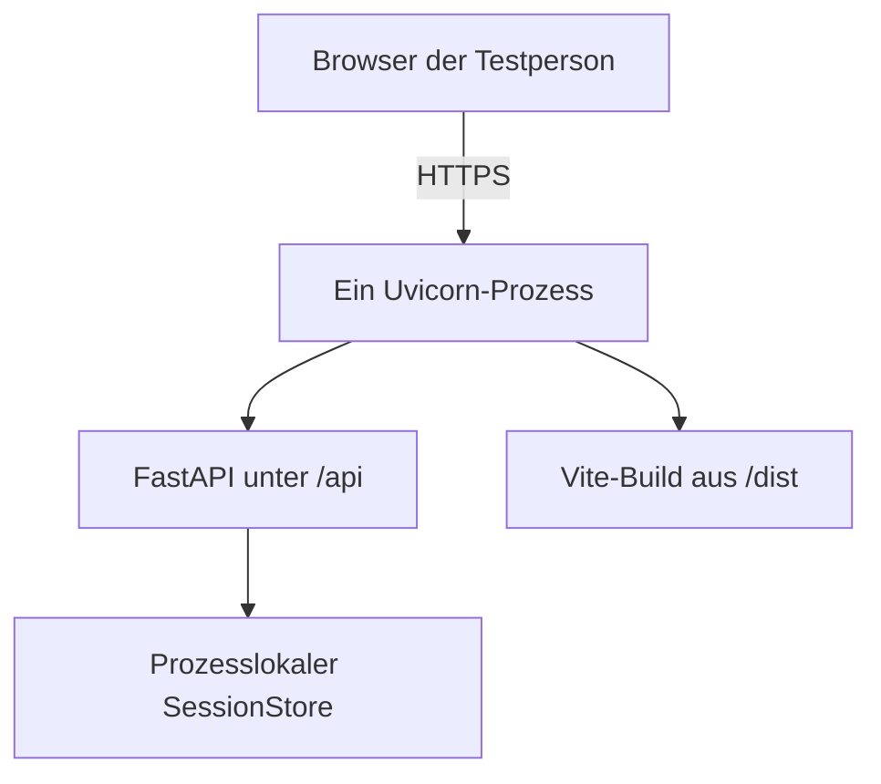

# Produktionsdeployment für die Benutzerstudie

Stand: 24. September 2026

## Zielarchitektur

Für die Benutzerstudie werden Oberfläche und API als ein einzelner
Docker-Web-Service bereitgestellt:

Diese Form ist für den aktuellen Prototyp wichtig: Alle Requests einer Sitzung
erreichen denselben Prozess und damit denselben In-Memory-`SessionStore`.

## Repositorykonfiguration

- `Dockerfile`: baut das React-Frontend und die Python-Laufzeit in getrennten
  Stufen; das Endimage enthält keine Node-Entwicklungsumgebung.
- `.dockerignore`: hält lokale Umgebungen, Tests und Dokumentation aus dem
  Build-Kontext heraus.
- `backend/api.py`: bindet `dist` nach den API-Routen als statische Anwendung
  ein.
- `render.yaml`: beschreibt einen Docker-Web-Service in Frankfurt, Plan
  `free`, Healthcheck `/api/health` und Deployment nach jedem Commit.

## Öffentliche Instanz

Die Anwendung ist unter
[routing-simulator-hci-concept.onrender.com](https://routing-simulator-hci-concept.onrender.com/)
veröffentlicht. Render baut den in `render.yaml` beschriebenen Docker-Service
aus dem Repository. Es wird genau eine Instanz mit einem Uvicorn-Prozess
verwendet.

Der kostenlose Dienst kann nach Inaktivität verzögert starten. Vor einem
moderierten Test sollte `/api/health` deshalb einmal aufgerufen werden. Für eine
unmoderierte Studie ist ein dauerhaft aktiver Plan vorzuziehen, wenn Kaltstarts
die Aufgabenbearbeitung beeinträchtigen.

## Öffentlicher Smoke-Test

Die Testversion darf erst an Teilnehmende verteilt werden, wenn diese Prüfungen
auf der öffentlichen Basis-URL bestanden sind:

1. `/` zeigt die vollständige Oberfläche.
2. `/api/health` antwortet mit `{"status":"ok"}`.
3. `graphml_mini.graphml`, eine SNDlib-XML-Datei und eine TopoHub-JSON-Datei
   lassen sich importieren.
4. Ziel, Metrik und Strategie können geändert werden.
5. Ein Kantenausfall kann ausgelöst und repariert werden.
6. Die kritische Bonsai-Ausfallsuche liefert den dokumentierten Referenzfall.
7. Ein Browser-Neuladen darf die Oberfläche zurücksetzen; während einer
   laufenden Sitzung dürfen reguläre Änderungen aber kein `session not found`
   erzeugen.
8. Browserkonsole und Netzwerkansicht zeigen keine neuen Fehler.

## Betriebsgrenzen

- Nur ein Uvicorn-Worker und eine Serviceinstanz.
- Sessions sind flüchtig und gehen bei Neustart oder Deployment verloren.
- Keine personenbezogenen Daten in der Anwendung speichern.
- Den evaluierten Commit nach Studienbeginn nicht funktional verändern.
- Für Tests und Benutzerstudie ausschließlich die oben genannte Render-URL
  verwenden.
