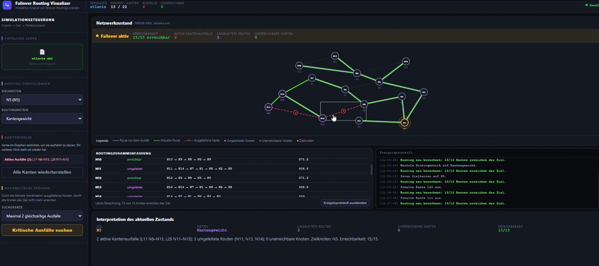
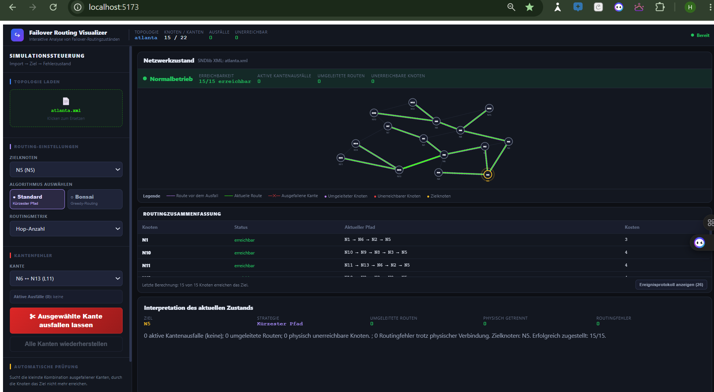
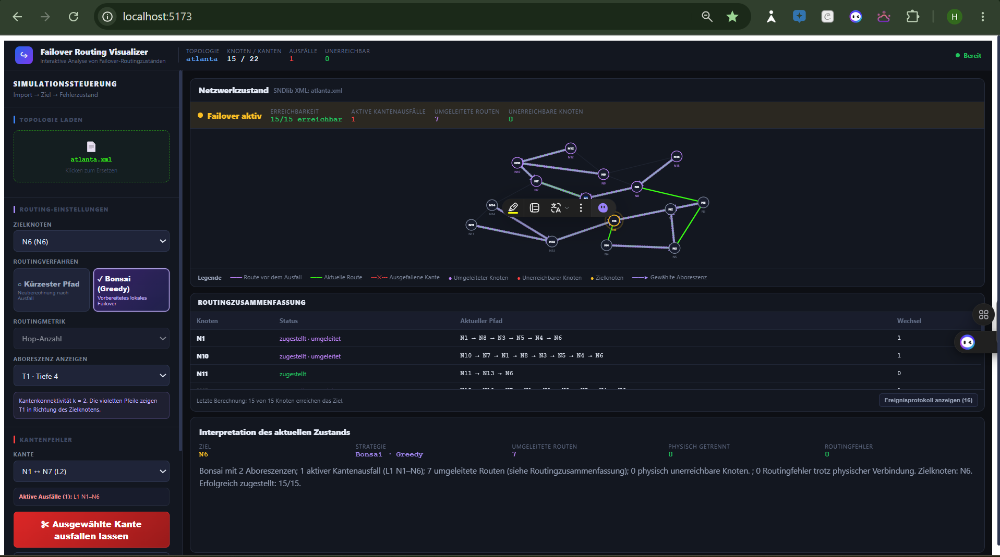
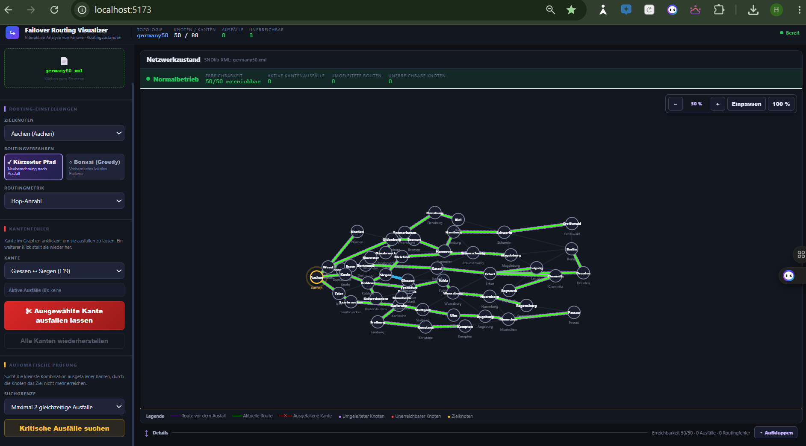
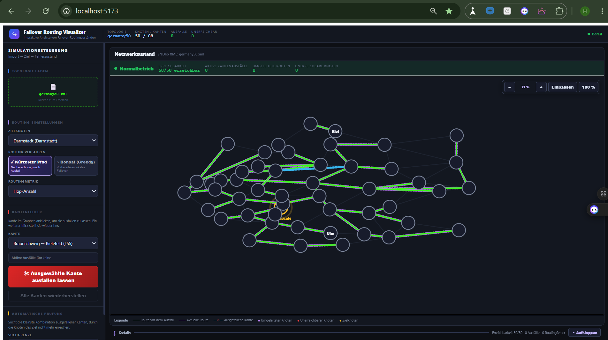
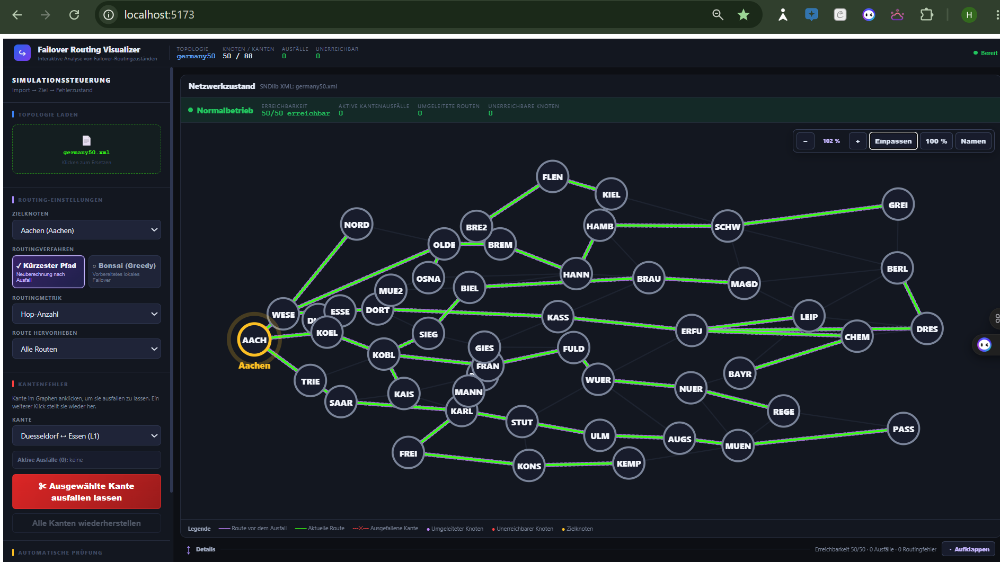
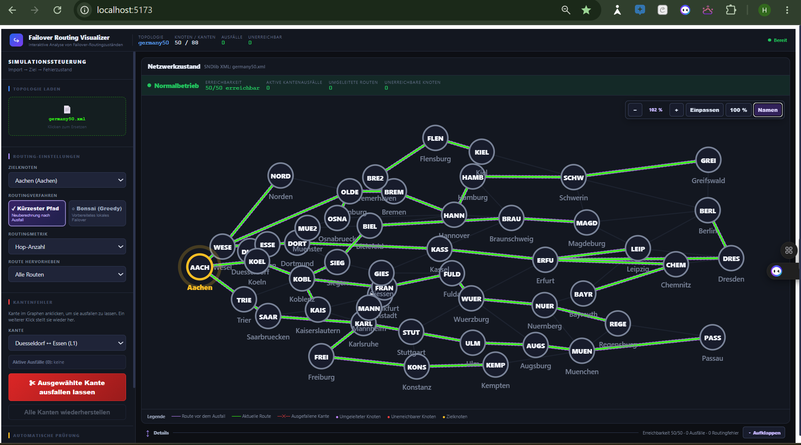

# Formative HCI-Evaluation des Failover Routing Visualizers

Stand: 9. September 2026

## 1. Zweck und Status

Dieses Dokument bewertet die bisherige Entwicklung des Prototyps aus einer
angenommenen Betreuerperspektive. Es verbindet drei Arten von Evidenz:

1. eine formative Expertenprüfung der Benutzungsoberfläche,
2. einen Vergleich dokumentierter Entwicklungsstände und
3. ein reproduzierbares Protokoll für eine noch durchzuführende Benutzerstudie.

Die Expertenprüfung ist **keine empirische Benutzerstudie**. Es werden daher
keine Teilnehmenden, Bearbeitungszeiten oder Erfolgsquoten erfunden. Solche
Ergebnisse dürfen erst nach der tatsächlichen Durchführung eingetragen werden.

## 2. Evaluationsfragen

Die Evaluation untersucht folgende Fragen:

| ID | Frage |
|---|---|
| EF-1 | Verstehen Nutzende, welches Routingverfahren aktiv ist? |
| EF-2 | Können Nutzende einen Kantenausfall auslösen, seine Folgen erkennen und ihn rückgängig machen? |
| EF-3 | Können sie physische Trennung, Bonsai-Schleife und Sackgasse unterscheiden? |
| EF-4 | Bleibt die Topologie bei 15 und bei 50 Knoten übersichtlich und navigierbar? |
| EF-5 | Sind Ziel, aktuelle Route, Baseline, ausgefallene Kanten und Aboreszenz visuell unterscheidbar? |
| EF-6 | Unterstützt die Oberfläche eine Erklärung des Ergebnisses gegenüber Dritten? |

## 3. Formative Bewertung der Entwicklungsstufen

### 3.1 Ausgangszustand: Failover ohne Bonsai-Auswahl

**Beobachtung:** Der ursprüngliche Vertikalschnitt konnte Topologien laden,
Kanten deaktivieren, Routen neu berechnen und betroffene Knoten anzeigen. Die
Darstellung erklärte jedoch nur das Verhalten einer einzigen
Shortest-Path-Strategie. Ein Vergleich mit vorbereitetem lokalem Failover war
nicht möglich.

**HCI-Bedeutung:** Systemstatus und Reversibilität waren bereits vorhanden.
Das mentale Modell blieb aber unvollständig, weil die verwendete Strategie nur
über die Routingmetrik und nicht als bewusst gewähltes Verfahren sichtbar war.

### 3.2 Sichtbare Auswahl des Routingverfahrens

**Änderung:** Die Oberfläche trennt nun klar zwischen `Kürzester Pfad` und
`Bonsai (Greedy)`. Kurze Untertitel erklären den Unterschied zwischen
Neuberechnung nach einem Ausfall und vorbereitetem lokalem Failover.

**Bewertung:** Diese Auswahl verbessert Sichtbarkeit und Vergleichbarkeit. Die
Nutzenden müssen die technische Bezeichnung nicht aus einem Metrikfeld
ableiten. Die Entscheidung befindet sich dort, wo Ziel und Routingmetrik
konfiguriert werden, und folgt damit dem Ablauf Import → Ziel → Verfahren →
Fehlerzustand.

### 3.3 Bonsai-Modus und ausgewählte Aboreszenz

**Änderung:** Der Bonsai-Modus zeigt die Anzahl der Aboreszenzen, den gewählten
Baum, gerichtete violette Pfeile, den tatsächlichen Paketpfad sowie die Anzahl
der Baumwechsel. Physische Trennungen und Routingfehler werden getrennt
ausgewiesen.

**Bewertung:** Das System macht den internen Zustand sichtbar. Besonders
wichtig ist die Trennung zwischen „kein physischer Weg vorhanden“ und „ein Weg
ist vorhanden, Bonsai erreicht das Ziel aber nicht“. Diese Unterscheidung ist
der fachliche Kern des neuen Modus.

**Verbleibende Detailfrage:** Die Routingzusammenfassung zeigt Pfad, Status und
Wechselanzahl. Der vollständige schrittweise Trace mit dem genauen Wechselknoten
ist im Backend vorhanden, aber noch nicht als eigene Detailansicht im Frontend.
Diese Erweiterung ist nur erforderlich, wenn sie für die Forschungsfrage oder
Betreuerabnahme ausdrücklich benötigt wird.

### 3.4 Erste Großgraph-Darstellung

**Problem:** Bei 50 Knoten blieb die Topologie klein in der Mitte der großen
Zeichenfläche. Gleichzeitig überlagerten sich lange Ortsnamen. Die zusätzliche
Fläche durch das Einklappen der Detailbereiche wurde nicht wirksam genutzt.

**HCI-Folge:** Die Oberfläche bot zwar Kontrolle über Zoom und Panelgröße, die
Ausgangsdarstellung erhöhte aber Suchaufwand und visuelle Unruhe.

### 3.5 Automatisches Einpassen mit zu starker Informationsreduktion

**Änderung:** Neue Topologien wurden automatisch eingepasst und lange
Beschriftungen in der Übersicht ausgeblendet.

**Problem:** Die Fläche wurde besser genutzt, viele Knoten wirkten jedoch wie
leere Kreise. Die Reduktion entfernte damit auch Information, die für die
Orientierung notwendig ist.

**Lernpunkt:** Kognitive Entlastung darf nicht zu fehlender Identifizierbarkeit
führen. Eine gute Übersicht benötigt stabile Kurzbezeichnungen und Details auf
Anfrage.

### 3.6 Aktuelle Standardübersicht mit eindeutigen Kürzeln

**Änderung:** Jeder Knoten besitzt ein deterministisches, eindeutiges Kürzel.
Der vollständige Name erscheint per Tooltip. Ziel-, Fehler-, Umleitungs- und
ausgewählte Startknoten bleiben beschriftet. Zusätzlich kann die Darstellung
auf die Route eines Startknotens reduziert werden.

**Bewertung:** Dieser Zustand eignet sich als Standard für große Graphen. Er
unterstützt das Prinzip „Übersicht zuerst, Details auf Anfrage“: Struktur und
Routingmuster bleiben sichtbar, während einzelne Knoten weiterhin eindeutig
identifizierbar sind.

### 3.7 Optionale Anzeige aller Namen

**Beobachtung:** Die Option `Namen` stellt alle vollständigen Bezeichnungen dar.
In dichten Regionen entstehen erwartbar Überlagerungen.

**Bewertung:** Diese Ansicht sollte nicht der Standard sein. Sie ist eine
bewusste Detailoption und eignet sich eher nach dem Hineinzoomen oder zusammen
mit einer hervorgehobenen Einzelroute. Für die Standardnutzung sind Kürzel und
Tooltip vorzuziehen.

## 4. Heuristische Gesamtbewertung

| Kriterium | Aktueller Stand | Bewertung |
|---|---|---|
| Sichtbarkeit des Systemstatus | Statusleiste, Kennzahlen, Interpretation und Ereignisprotokoll | gut |
| Übereinstimmung mit dem Fachmodell | Ziel, Kanten, Routen, Bäume und Fehlerarten sind fachlich benannt | gut |
| Kontrolle und Freiheit | Ausfälle sind direkt umkehrbar; Panels, Zoom und Pan sind kontrollierbar | gut |
| Konsistenz | Farben und Statusbegriffe werden in Graph, Legende und Tabellen wiederverwendet | gut |
| Fehlervermeidung | Auswahlzustand und separate Ausfallaktion reduzieren versehentliche Änderungen | gut |
| Wiedererkennen statt Erinnern | Algorithmuskarten, Legende, Kürzel und Tooltip unterstützen Orientierung | gut |
| Flexibilität | Einpassen, Zoom, einklappbare Details und Einzelroute skalieren auf verschiedene Aufgaben | gut |
| Minimalistisches Design | Standardübersicht ist reduziert; „alle Namen“ kann bei großen Graphen überladen | teilweise offen |
| Verständliche Fehlerdiagnose | physische Trennung, Schleife und Sackgasse werden unterschieden | gut |
| Hilfe und Dokumentation | README und Bonsai-Dokumentation vorhanden | gut |

## 5. Nutzungsszenarien für die Evaluation

### Szenario A: Normalzustand verstehen

**Ausgangslage:** `atlanta.xml`, keine Ausfälle, kürzester Pfad.

**Aufgabe:** Ziel `N1` wählen und erklären, wie viele Knoten das Ziel erreichen
und welche Farbe die aktuelle Route besitzt.

**Erfolg:** Die Person nennt Ziel, Erreichbarkeit und aktuelle Route korrekt,
ohne Unterstützung durch die Testleitung.

### Szenario B: Manuellen Kantenausfall untersuchen

**Ausgangslage:** Atlanta, kürzester Pfad.

**Aufgabe:** Eine Kante im Graphen ausfallen lassen, die Folgen erklären und die
Kante anschließend wiederherstellen.

**Erfolg:** Ausfall und Reparatur gelingen; die Person erkennt umgeleitete oder
unerreichbare Knoten und kann die Statusänderung erklären.

### Szenario C: Routingverfahren vergleichen

**Ausgangslage:** Atlanta ohne Ausfall.

**Aufgabe:** Von `Kürzester Pfad` zu `Bonsai (Greedy)` wechseln, eine
Aboreszenz auswählen und den Unterschied der Verfahren mit eigenen Worten
erklären.

**Erfolg:** Die Person unterscheidet Neuberechnung nach Ausfall von vorbereitetem
lokalem Failover und erkennt die gerichteten Baumkanten.

### Szenario D: Routingfehler trotz physischer Verbindung

**Ausgangslage:** `tests/fixtures/bonsai_routing_failure.json`, Ziel `T`, Bonsai.

**Aufgabe:** Mit der automatischen Prüfung einen kritischen Einzelausfall finden,
ihn übernehmen und beurteilen, ob eine physische Trennung oder ein Routingfehler
vorliegt.

**Erfolg:** Die Person identifiziert die Schleife als Routingfehler bei weiterhin
vorhandenem physischem Weg.

### Szenario E: Große Topologie navigieren

**Ausgangslage:** `germany50.xml`.

**Aufgabe:** Ziel `Aachen` wählen, die Topologie einpassen, einen unbekannten
Knoten per Tooltip identifizieren, eine einzelne Startknotenroute hervorheben und
bei Bedarf alle Namen einblenden.

**Erfolg:** Die Person findet und erklärt alle Funktionen, ohne die Orientierung
im Graphen zu verlieren.

## 6. Protokoll für eine kleine Benutzerstudie

### 6.1 Empfohlenes Design

- formative Studie mit etwa fünf bis acht Personen,
- möglichst Mischung aus Personen mit und ohne Routing-Vorkenntnisse,
- Einzeltermine von ungefähr 25 bis 35 Minuten,
- Think-Aloud während der Aufgaben,
- identische Topologien und Aufgabenreihenfolge,
- Bildschirmaufnahme nur nach ausdrücklicher Einwilligung,
- keine personenbezogenen Daten im Ergebnisbericht.

### 6.2 Ablauf

1. Zweck, Datenschutz und Einwilligung erklären.
2. Vorkenntnisse knapp erfassen, ohne die Bedienung vorwegzunehmen.
3. Szenarien A bis E nacheinander bearbeiten lassen.
4. Pro Aufgabe Erfolg, Zeit, Hilfen, Fehlhandlungen und Kommentare notieren.
5. Nach jeder Aufgabe eine Schwierigkeitseinschätzung von 1 bis 7 erfassen.
6. Abschließend drei offene Fragen stellen.

### 6.3 Neutrale Abschlussfragen

1. Was war beim Verstehen des Netzwerkzustands am hilfreichsten?
2. Wo war unklar, was nach einer Aktion passiert ist?
3. Welche Information oder Funktion hat gefehlt?

### 6.4 Erfassungsbogen

| Person | Aufgabe | Erfolg ohne Hilfe | Zeit | Fehlhandlungen | Hilfen | Schwierigkeit 1–7 | Beobachtung |
|---|---|---:|---:|---:|---:|---:|---|
| P01 | A |  |  |  |  |  |  |
| P01 | B |  |  |  |  |  |  |
| P01 | C |  |  |  |  |  |  |
| P01 | D |  |  |  |  |  |  |
| P01 | E |  |  |  |  |  |  |

### 6.5 Auswertung

Für jede Aufgabe werden berichtet:

- Anteil erfolgreicher Bearbeitungen ohne Hilfe,
- Median der Bearbeitungszeit,
- häufigste Fehlhandlungen,
- Median der Schwierigkeitseinschätzung,
- wiederkehrende qualitative Beobachtungen.

Bei einer kleinen formativen Stichprobe sind qualitative Muster wichtiger als
Signifikanztests. Einzelne Aussagen dürfen nicht als allgemeingültiger Nachweis
formuliert werden.

## 7. Screenshot-Protokoll für die Bachelorarbeit

Die vorhandenen Bilder dokumentieren die Entwicklung, enthalten aber teilweise
Browserrahmen oder eingeblendete Browser-Erweiterungen. Für die endgültige
Arbeit sollten ausgewählte Zustände nochmals kontrolliert aufgenommen werden:

- identische Fenstergröße und Skalierung,
- Browser-Vollbild oder sauberer Zuschnitt auf die Anwendung,
- keine Profile, Erweiterungen oder personenbezogenen Inhalte,
- Topologie, Ziel, Verfahren und Ausfälle in der Bildunterschrift,
- Commit-ID und Datum in einer separaten Screenshot-Tabelle,
- keine nachträgliche inhaltliche Veränderung des dargestellten Ergebnisses.

Empfohlene finale Abbildungen:

1. Shortest-Path-Normalzustand,
2. manueller Ausfall mit Umleitung,
3. Bonsai mit ausgewählter Aboreszenz,
4. Bonsai-Schleife trotz physischer Verbindung,
5. Germany50 als Standardübersicht,
6. Germany50 mit hervorgehobener Einzelroute.

## 8. Offene Punkte und Priorität

| Priorität | Punkt | Entscheidung |
|---|---|---|
| hoch | Greedy, vollständige Bäume und zirkuläre Wechselregel fachlich bestätigen | mit Betreuer anhand der drei Referenzfälle abnehmen |
| hoch | Tatsächliche Benutzerstudie durchführen | vor der Ergebnisdarstellung der Arbeit |
| mittel | GML-Anforderung gegen aktuellen JSON/XML-Import klären | nicht ohne bestätigten Bedarf implementieren |
| mittel | Schrittweisen Bonsai-Trace im Frontend zeigen | nur umsetzen, wenn Forschungsfrage oder Abnahme ihn benötigt |
| niedrig | Anzeige aller Namen weiter entzerren | Standardübersicht und Tooltip sind bereits nutzbar |
| außerhalb | Round-Robin, RR-Swapping und weitere Routingverfahren | nicht Teil dieses Sprints |

## 9. Betreuerorientiertes Sprinturteil

Der technische Vertikalschnitt ist für den vereinbarten Sprint vollständig:
Import, Strategiewahl, Greedy-Aboreszenzen, zirkuläres Failover, getrennte
Fehlerklassifikation, automatische Suche und Visualisierung sind integriert und
automatisch getestet. Der nächste sinnvolle Schritt ist keine weitere große
Funktion, sondern die fachliche Abnahme der getroffenen Annahmen und eine kleine,
sauber protokollierte Benutzerstudie.

Die Screenshots belegen nachvollziehbar, wie konkrete Darstellungsprobleme zu
Änderungen geführt haben. Sie sind damit als formative Designhistorie geeignet.
Empirische Aussagen über Verständlichkeit oder Gebrauchstauglichkeit dürfen
jedoch erst nach Durchführung und Auswertung der Studie gemacht werden.
