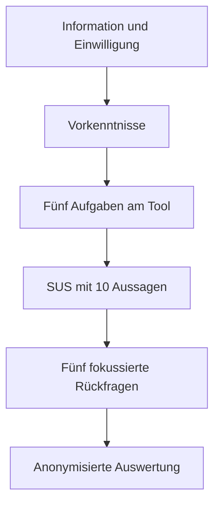

# LimeSurvey-Protokoll für die HCI-Benutzerstudie

Stand: 24. September 2026
Status: Vom Betreuer geprüft, in LimeSurvey umgesetzt und für die laufende
Benutzerstudie veröffentlicht

## Ziel und Studiendesign

Die formative Studie prüft, ob Nutzende Routingzustände, Ausfälle und die
Unterscheidung zwischen physischer Unerreichbarkeit und Bonsai-Routingfehlern
mit dem Tool nachvollziehen können. Bis zum 24. September hatten zehn Personen
teilgenommen. Wegen der kleinen Gelegenheitsstichprobe werden keine
repräsentativen oder inferenzstatistischen Aussagen beansprucht.

## LimeSurvey-Struktur

### Gruppe 0: Information und Einwilligung

Anzuzeigen sind Zweck, ungefähre Dauer, Freiwilligkeit, anonyme Verarbeitung,
Abbruchmöglichkeit und Kontakt. Eine Bildschirmaufnahme erfolgt bei moderierten
Terminen nur mit separater ausdrücklicher Einwilligung.

Pflichtfrage `CONSENT`:

- Ich habe die Informationen gelesen und möchte teilnehmen.
- Ich möchte nicht teilnehmen. → Umfrage beenden.

Keine Namen, E-Mail-Adressen, Matrikelnummern oder IP-Adressen exportieren. Die
LimeSurvey-Einstellungen für anonymisierte Antworten sind vor dem Start zu
prüfen.

### Gruppe 1: Vorkenntnisse

| Code | Frage | Antwortformat |
|---|---|---|
| PRE01 | Wie schätzen Sie Ihre allgemeinen Computerkenntnisse ein? | 1 sehr gering bis 5 sehr hoch |
| PRE02 | Wie schätzen Sie Ihre Kenntnisse zu Computernetzen und Routing ein? | 1 sehr gering bis 5 sehr hoch |
| PRE03 | Wie vertraut sind Sie mit Netzwerkgraphen oder Netzwerksimulatoren? | 1 gar nicht bis 5 sehr vertraut |
| PRE04 | Wie vertraut sind Sie mit gerichteten Bäumen/Aboreszenzen? | 1 gar nicht bis 5 sehr vertraut; kurze Erklärung des Begriffs anzeigen |
| PRE05 | Haben Sie schon ein vergleichbares Netzwerk- oder Routingwerkzeug benutzt? | nein / ja, gelegentlich / ja, regelmäßig |

### Gruppe 2: Aufgaben

Vor jeder Aufgabe wird nur das Ziel beschrieben. Der Fragebogen soll keine
Schaltfläche verraten, deren Auffindbarkeit gerade geprüft wird. Nach jeder
Aufgabe folgt die Pflichtauswahl `abgeschlossen`, `versucht, nicht geschafft`
oder `übersprungen`. Dadurch erreichen alle Personen anschließend die SUS.

| Code | Aufgabe | Erfolgskriterium |
|---|---|---|
| TASK01 | Laden Sie die kleine Atlanta-Topologie, wählen Sie das angegebene Ziel und bestimmen Sie, ob alle Knoten das Ziel erreichen. | Topologie geladen, Ziel erkannt, Erreichbarkeit korrekt abgelesen |
| TASK02 | Lassen Sie eine Verbindung ausfallen, erklären Sie die sichtbare Änderung und stellen Sie das Netzwerk wieder her. | Ausfall und Reparatur gelingen; Umleitung oder Unerreichbarkeit wird benannt |
| TASK03 | Wechseln Sie zum Bonsai-Verfahren, wählen Sie einen Baum und erklären Sie den Unterschied zum kürzesten Pfad. | vorbereiteter Baum und Neuberechnung werden unterschieden |
| TASK04 | Suchen Sie einen kritischen Bonsai-Ausfall und entscheiden Sie, ob der Fehler physisch oder nur im Routing auftritt. | Routingfehler trotz physisch vorhandenem Pfad wird erkannt |
| TASK05 | Öffnen Sie Germany50, identifizieren Sie einen unbekannten Knoten und untersuchen Sie die Route eines Startknotens. | Einpassen/Zoom, Kürzel/Tooltip und Einzelroute werden erfolgreich genutzt |

Für eine unmoderierte Online-Studie wird pro Aufgabe zusätzlich nur eine
Schwierigkeitsskala von 1 `sehr einfach` bis 7 `sehr schwierig` erhoben. Bei
moderierten Sitzungen protokolliert die Testleitung außerdem Zeit, Hilfen und
Fehlhandlungen außerhalb von LimeSurvey.

### Gruppe 3: System Usability Scale

Die zehn SUS-Aussagen werden **wortgleich und in derselben Reihenfolge** aus der
vom Betreuer bereitgestellten, zitierten Fassung übernommen. Sie werden hier nicht
frei übersetzt oder umformuliert. Antwortskala für jede Aussage:

1. stimme überhaupt nicht zu
2. stimme eher nicht zu
3. weder noch
4. stimme eher zu
5. stimme vollständig zu

LimeSurvey-Codes: `SUS01` bis `SUS10`. Alle zehn Antworten sind Pflichtfelder.

Auswertung der klassischen alternierenden SUS-Fassung:

- ungerade Aussagen: Antwort minus 1,
- gerade Aussagen: 5 minus Antwort,
- Summe der zehn Beiträge mal 2,5,
- Ergebnisbereich 0 bis 100.

Vor dem Start ist zu kontrollieren, dass die verwendete deutsche Fassung die
klassische alternierende Polung besitzt. Eine ausschließlich positiv formulierte
Variante darf nicht mit dieser Formel ausgewertet werden. Primärquelle:
John Brooke, *SUS: A “Quick and Dirty” Usability Scale* (1996).

### Gruppe 4: Projektspezifische Rückfragen

Diese Fragen folgen erst nach der SUS, damit sie deren Antworten nicht
vorstrukturieren.

| Code | Frage | Format |
|---|---|---|
| POST01 | Nach einer Aktion war für mich klar, was sich im System geändert hat. | 1 stimme gar nicht zu bis 5 stimme vollständig zu |
| POST02 | Ich konnte erkennen, welches Routingverfahren und welcher Baum aktiv waren. | 1 bis 5 |
| POST03 | Ich konnte physische Unerreichbarkeit und einen Bonsai-Routingfehler unterscheiden. | 1 bis 5 plus `nicht beurteilt` |
| POST04 | Farben, Linienarten, Symbole und Beschriftungen machten die wichtigsten Zustände unterscheidbar. | 1 bis 5 |
| POST05 | Welche eine Information oder Funktion hat Ihnen am meisten gefehlt? | optionales kurzes Freitextfeld, maximal 500 Zeichen |

Breite Fragen wie „Wie gefällt Ihnen die GUI?“ werden nicht zusätzlich
gestellt, weil SUS und die fokussierten Fragen diese Aspekte bereits erfassen.

## Moderationsbogen

| Person | Aufgabe | Ergebnis | Zeit | Hilfen | Fehlhandlungen | Beobachtung |
|---|---|---:|---:|---:|---:|---|
| P01 | 01 |  |  |  |  |  |
| P01 | 02 |  |  |  |  |  |
| P01 | 03 |  |  |  |  |  |
| P01 | 04 |  |  |  |  |  |
| P01 | 05 |  |  |  |  |  |

## Auswertungsplan

1. Unvollständige Datensätze und Ausschlussregeln transparent dokumentieren.
2. Pro Aufgabe `abgeschlossen`, `nicht geschafft` und `übersprungen` berichten.
3. Für moderierte Tests Medianzeit, Hilfen und wiederkehrende Fehlhandlungen
   zusammenfassen.
4. SUS pro Person berechnen; Verteilung, Median, Mittelwert und Spannweite
   berichten. Den Wert nicht als Prozent interpretieren.
5. Die zehn SUS-Aussagen einzeln als Likert-Verteilungen oder Boxplots zeigen.
6. POST01 bis POST04 deskriptiv auswerten; POST05 thematisch codieren und nur
   anonymisierte kurze Beispiele verwenden.
7. Vorkenntnisse höchstens explorativ gegenüberstellen; bei kleiner Stichprobe
   keine Signifikanztests oder allgemeingültigen Gruppenunterschiede behaupten.
8. Nicht umgesetzte Wünsche als Limitation oder zukünftige Arbeit aufnehmen.

## Zeitplan und Freigabe

| Datum | Schritt |
|---|---|
| 15.–16. September | LimeSurvey-Entwurf und öffentlichen Toolzugang fertiggestellt |
| 16. September | Prüfung durch den Betreuer abgeschlossen |
| anschließend | Studie aktiviert und Teilnehmende eingeladen |
| 28.–30. September | Erhebung beenden und Datenexport einfrieren |
| anschließend | auswerten, Abbildungen erzeugen und Ergebniskapitel schreiben |

Die öffentlich getestete Anwendungsversion und ihr Commit werden beim
Studienstart eingefroren und im Ergebnisbericht angegeben.
